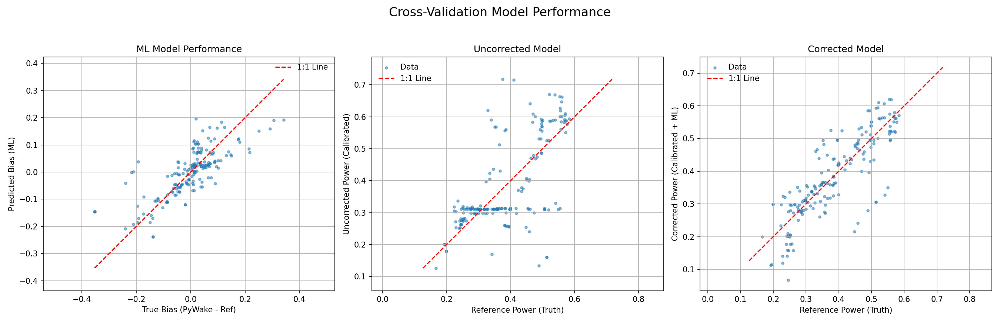

# Tutorial: Single-Farm XGBoost Workflow

This tutorial walks through a complete single-farm workflow using XGBoost
for bias prediction and local calibration.

## Prerequisites

- WIFA-UQ installed (`pixi install`)
- Example data in `examples/data/KUL_LES/`

## Step 1: Understand the Configuration

Open `examples/kul_single_farm_xgb_example.yaml`:
```yaml
# Key sections explained...
```

## Step 2: Run the Workflow
```bash
cd examples
python run.py kul_single_farm_xgb_example.yaml
```

## Step 3: Examine Outputs
```
results/KUL_LES_xgb/
├── processed_physical_inputs.nc    # Preprocessed resource data
├── results_stacked_hh.nc           # Model error database
├── correction_results.png          # Before/after correction
├── bias_prediction_shap.png        # Feature importance (beeswarm)
├── bias_prediction_shap_importance.png  # Feature importance (bar)
├── local_parameter_prediction.png  # Parameter prediction quality
└── cv_results.csv                  # Cross-validation metrics
```

## Step 4: Interpret Results

### Correction Results



- **Left**: ML prediction quality (predicted vs true bias)
- **Center**: Uncorrected model error
- **Right**: Corrected model error (should be tighter around 1:1 line)

### SHAP Analysis

The SHAP plots show which features most influence bias predictions...

## Next Steps

- Try different calibrators: `MinBiasCalibrator` vs `LocalParameterPredictor`
- Experiment with feature sets
- Run multi-farm cross-validation
